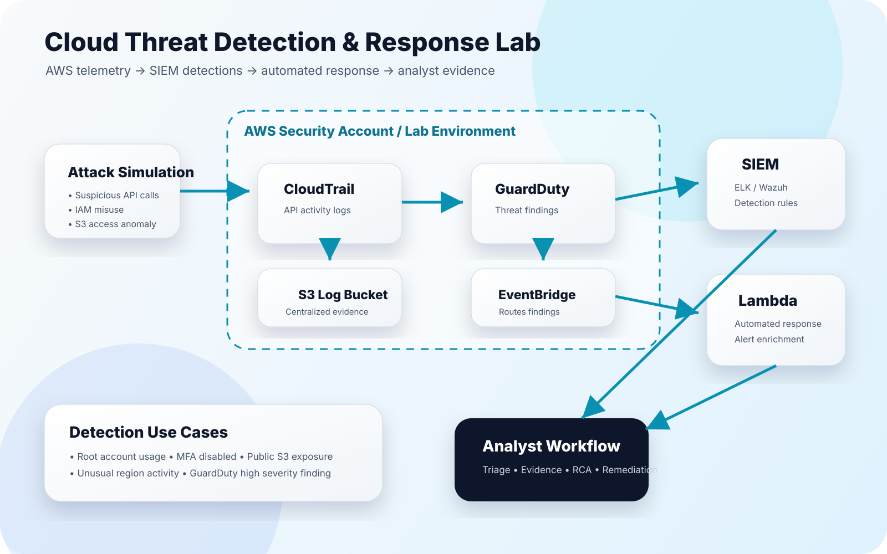

# Cloud Threat Detection & Response Lab

A hands-on cloud security project designed to simulate suspicious AWS activity, collect telemetry, build detections, and trigger automated response workflows.

## Project Goal

Build a realistic cloud detection and response lab that demonstrates:

- AWS security telemetry collection
- SIEM-style detection engineering
- GuardDuty finding analysis
- Event-driven response automation
- Analyst triage and evidence collection
- Clear documentation for recruiters and hiring managers

## Architecture



### Core Flow

1. Simulate suspicious activity in a controlled AWS environment.
2. Collect API activity using AWS CloudTrail.
3. Send logs to an S3 bucket for centralized evidence.
4. Use GuardDuty for managed threat findings.
5. Route findings through EventBridge.
6. Trigger Lambda response functions.
7. Forward enriched alerts to SIEM-style analysis.
8. Document triage, root cause, and response actions.

## Tools & Services

| Area | Tool / Service |
|---|---|
| Cloud | AWS |
| Logging | CloudTrail |
| Threat Detection | GuardDuty |
| Event Routing | EventBridge |
| Response Automation | Lambda |
| Evidence Storage | S3 |
| Scripting | Python |
| SIEM / Analysis | ELK or Wazuh |
| Documentation | Markdown, diagrams |

## Planned Detection Use Cases

### 1. Root Account Usage

Detects use of the AWS root account.

**Why it matters:** Root account usage should be rare and investigated immediately.

Possible CloudTrail fields:

```json
{
  "userIdentity.type": "Root",
  "eventSource": "signin.amazonaws.com"
}
```

### 2. MFA Disabled

Detects attempts to deactivate MFA.

```json
{
  "eventName": "DeactivateMFADevice"
}
```

### 3. Public S3 Bucket Exposure

Detects changes that could expose an S3 bucket publicly.

```json
{
  "eventName": ["PutBucketPolicy", "PutBucketAcl", "PutPublicAccessBlock"]
}
```

### 4. Unusual Region Activity

Detects activity from regions not normally used in the environment.

```json
{
  "awsRegion": "region-not-in-approved-list"
}
```

### 5. GuardDuty High Severity Finding

Routes high severity findings to an automated triage workflow.

```json
{
  "source": "aws.guardduty",
  "detail.severity": ">= 7"
}
```

## Repository Structure

```text
cloud-threat-detection-response-lab/
├── README.md
├── docs/
│   ├── cloud-threat-detection-response-lab.svg
│   ├── architecture.md
│   ├── threat-model.md
│   └── screenshots/
├── detections/
│   ├── cloudtrail/
│   │   ├── root-account-usage.md
│   │   ├── mfa-disabled.md
│   │   ├── public-s3-exposure.md
│   │   └── unusual-region-activity.md
│   └── guardduty/
│       └── high-severity-finding.md
├── lambda/
│   ├── alert_enrichment.py
│   ├── isolate_instance.py
│   └── notify_analyst.py
├── eventbridge/
│   ├── guardduty-high-severity-rule.json
│   └── cloudtrail-sensitive-api-rule.json
├── sample-logs/
│   ├── cloudtrail-root-login.json
│   ├── cloudtrail-mfa-disabled.json
│   └── guardduty-finding.json
├── reports/
│   ├── incident-report-template.md
│   └── sample-triage-report.md
└── screenshots/
```

## Build Milestones

### Phase 1 — Documentation Foundation

- [ ] Add architecture diagram
- [ ] Write threat model
- [ ] Define detection use cases
- [ ] Add sample CloudTrail and GuardDuty logs
- [ ] Create incident report template

### Phase 2 — Detection Engineering

- [ ] Write CloudTrail detections
- [ ] Map detections to MITRE ATT&CK
- [ ] Add sample queries for ELK/Wazuh
- [ ] Add false positive notes
- [ ] Add severity and triage guidance

### Phase 3 — Automation

- [ ] Create EventBridge rules
- [ ] Create Lambda alert enrichment script
- [ ] Create notification workflow
- [ ] Add optional containment workflow

### Phase 4 — Portfolio Polish

- [ ] Add screenshots
- [ ] Add sample triage report
- [ ] Add lessons learned
- [ ] Add demo GIF or walkthrough
- [ ] Link project from personal website

## MITRE ATT&CK Mapping Ideas

| Scenario | MITRE Technique |
|---|---|
| Root account usage | Valid Accounts |
| MFA disabled | Modify Authentication Process |
| Public S3 exposure | Cloud Storage Object Discovery / Exfiltration Risk |
| Suspicious API activity | Cloud Service Dashboard / Cloud API |
| Unauthorized access attempt | Valid Accounts |

## Sample Portfolio Description

**Cloud Threat Detection & Response Lab**  
A hands-on AWS security lab simulating suspicious cloud activity, collecting CloudTrail and GuardDuty telemetry, building detection logic, and triggering automated response workflows with EventBridge and Lambda.

## Resume Bullet Options

- Built a cloud threat detection lab using AWS CloudTrail, GuardDuty, EventBridge, Lambda, and S3 to simulate, detect, and respond to suspicious cloud activity.
- Developed detection logic for root account usage, MFA deactivation, public S3 exposure, unusual region activity, and high-severity GuardDuty findings.
- Created response automation workflows to enrich alerts, preserve evidence, and support analyst triage.

## Safety / Ethics

This project is designed for defensive security research in a controlled lab environment. Do not run simulations against systems you do not own or have permission to test.
